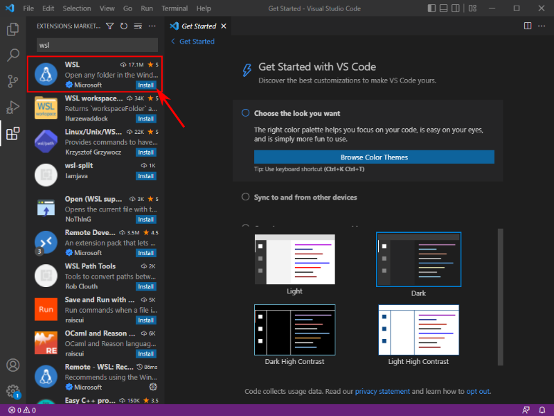

# Configuring Visual Studio Code

!!! warning
    
    This page is out of date, you can find more up-to-date information here:  
    <a href="https://tom-howard.github.io/ros/software/on-campus/vscode/" target="_blank">tom-howard.github.io/ros/software/on-campus/vscode</a>

*Visual Studio Code* (or *'VS Code'*, for short) should be installed on all the University of Sheffield Managed Desktop Computers in the Diamond Computer Rooms. This is a great *Integrated Development Environment (IDE)* that we'll use extensively alongside WSL-ROS. We first need to make sure it's set up correctly though, so follow the steps below **now** to install the *"Remote - WSL"* VS Code extension, in preparation for later.

!!! tip
    You should only ever need to do this bit once: the configurations should be saved to your user profile, and should be carried over to any other University Desktop Computer that you log into!

1. Click the Windows Start Menu button: 

1. Type `"vscode"` and the Visual Studio Code application shortcut should then appear in the list:

    <figure markdown>
      
    </figure>

    Click on it to launch the application.

1. In the left-hand toolbar click the "Extensions" icon (or use the `Ctrl+Shift+X` keyboard shortcut):

    <figure markdown>
      {width=600}
    </figure>

1. In the search bar (where is says "Search Extensions in Marketplace") type `"wsl"`, find the "WSL" extension in the list and then click the blue "Install" button next to it:

    <figure markdown>
      {width=600}
    </figure>

    Once installed, you should see a page similar to the one below:

    <figure markdown>
      {width=600}
    </figure>

    On this page, it should state that `"This extension is enabled globally"` (as shown in red), and you should also see a green icon with two arrows in the bottom left-hand corner of the application window.

1. You can close down VS Code now, we'll launch it again when we need it.